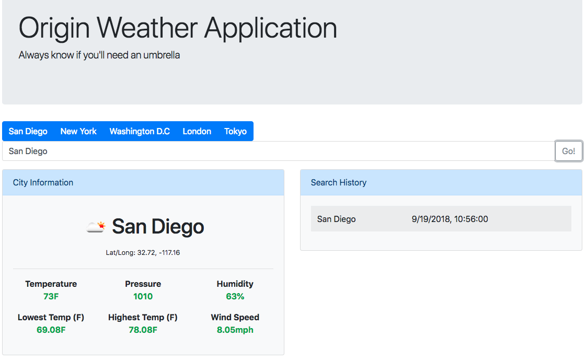

# Weather App

> A React/Redux application that allows a user to search for weather data using the OpenWeatherMap API.

This was my fifteenth project at Origin Code Academy. This app was made using React and Redux.



## Background

React is a JavaScript library for building user interfaces. Redux is an open-source JavaScript library for managing application state.

## Approach

I took a mobile-first approach with this app and created a responsive design contingent on the dimensions of the device screen.

## Installation

Download all associated files and load them up in your favorite text editor!

## Development setup

```
npm install
```

```
npm run build
```

```
npm start
```

## Contributing

- Please follow the AirBnB styleguide.

- Open a pull request, all contributions will be considered.

## Contact Information

Twitter: [@adriftinthesea](https://twitter.com/adriftinthesea)

Email: z@zamarise.com

GitHub: [https://github.com/zamarise](https://github.com/zamarise/)
